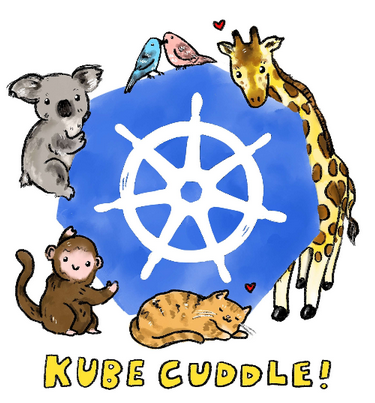

# Kubernetes

## Glossary

- **Kubernetes**: Greek for captain
- **k8s**: hacker talk for Kubernetes, [8 characters between k and s](https://twitter.com/lunasorcery/status/1278984875190689798)
- **pod**: a group of whales
- **Helm**: steering wheel of a boat

## In the beginning...

Started as a Google side project

Took inspiration from Borg

Filled in gaps Docker did “wrong”

Storage

Networking

Disaster recovery

Multi server aka clustering

It solved issues created by… cloud

Kubernetes abstracts the cloud provider away
into standard definitions

well… tries to

## What is Kubernetes?

Kubernetes doesn’t exist...

#

“Kubernetes is the new Linux”

Kubernetes are many moving parts,
Kubernetes has distros just like Linux

### Distros

Kubernetes Distros

Cloud

Google Kubernetes Engine

Amazon Elastic Kubernetes Service

...

Bring your own machines

Lokomotive

kubeadm

…

Small for your laptop

minikube

kind (kubernetes in docker)

### Objects in Kubernetes

#

apiVersion: v1

kind: Pod

metadata:

name: my-application

labels:

app: company-website-app

spec:

containers:

- name: webserver

image: mycompany/webserver:v1.0.0

Everything in Kubernetes is resource

resources are human written in YAML

Objects can also be generated/updated
by Kubernetes

API Objects have the following common fields:

Metadata: The name and namespace

Spec: The desired state of an object

Status: The current state of an object

Pod: a group of whales

apiVersion: v1

kind: Pod

metadata:

name: my-application

labels:

app: company-website-app

spec:

containers:

- name: webserver

image: mycompany/webserver:v1.0.0

Is one or more containers, usually ONE

Containers share one IP, one network

Can look at each other's disk, processes etc.

Smallest unit in Kubernetes (like atoms)

One pod per application!

You wouldn’t want to work on atomic level right?

Deployments: drive applications!

They take care of updating

They take care of scaling

They recreate pods should a server crash

Intermezzo: labels

#

Is how we link objects!

We make sure they are unique

metadata:

labels:

app: nginx

Kubernetes Magic?

#

Is a process called reconciling

Kubernetes will reconcile until reality matches
the spec.

You define the spec, k8s will make it happen

apiVersion: apps/v1

kind: Deployment

metadata:

name: nginx-deployment

labels:

app: nginx

spec:

replicas: 3

selector:

matchLabels:

app: nginx

template:

metadata:

labels:

app: nginx

spec:

containers:

- name: nginx

image: nginx:1.14.2

ports:

- containerPort: 80

How to talk Kubernetes

#

Command line utility

kubectl

(often “mis”pronounced as kube cuddle)

kubectl can create/delete/update everything in
Kubernetes

How to talk Kubernetes

#

kubectl create -f file.yaml

kubectl apply -f file.yaml

kubectl delete <type> <name>

kubectl get <resource>

But it can help you!

kubectl describe

How to talk Kubernetes

#

kubectl run?

Creates a Pod

Should only be used for testing!

The idea of kubernetes is having a defined
setup in files

## Namespaces

Namespace

#

Isolation

A security boundary

kubectl create <namespace>

kubectl -n <namespace>

default one: “default”

example: system services “kube-system”

Writing all that YAML for everything? No you silly!

#

Helm!

Your package manager for Kubernetes

https://artifacthub.io/ offers 2548 apps

https://artifacthub.io/packages/helm/bitnami/
mysql

Helm “charts”: allow configurable YAML, also for
YOUR apps :D
